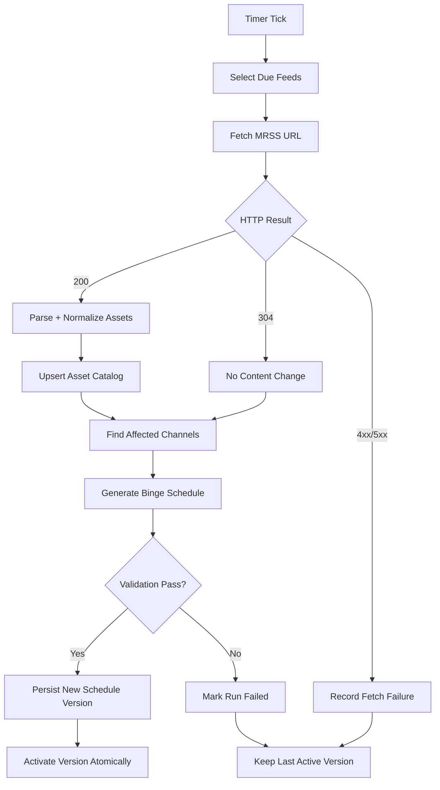

# Binge Scheduler Workflow / Process Flow

## 1) End-to-End Process Flow



## 1.1) DB-to-Ingestion-to-Scheduling Reference Flow

```mermaid
flowchart TD
  A[mrss_feeds + channel_mrss_sources configured] --> B[Ingestion trigger: CLI now / poller later]
  B --> C[Fetch MRSS URL]
  C --> D{HTTP result}
  D -->|304| E[No content change]
  D -->|200| F[Parse + normalize items]
  D -->|error| G[Update mrss_feeds fetch error metadata]
  F --> H[Upsert into mrss_assets by (mrss_feed_id, asset_id)]
  E --> I[Find affected channels by mrss_feed_id]
  H --> I
  I --> J[Create channel_schedule_runs row]
  J --> K[Generate binge timeline]
  K --> L[Validate entries]
  L -->|pass| M[Insert channel_schedule_entries]
  M --> N[Activate new run / deactivate previous active run]
  L -->|fail| O[Mark run failed]
  O --> P[Keep previous active schedule]
  G --> P
```

Notes:
- DB `updated_at` triggers only update timestamps; they do not execute ingest/scheduling logic.
- Feed updates at the same URL are detected by fetch layer metadata (`ETag`/`Last-Modified`) or payload diff fallback.

## 2) Feed Polling Workflow

1. Poller runs every minute.
2. Query due feeds:
   - `enabled = true`
   - `now() - coalesce(last_fetch_at, 'epoch') >= fetch_interval_seconds`
3. Lock feed row for processing (`FOR UPDATE SKIP LOCKED`) to avoid duplicate workers.
4. Send conditional request with stored `etag` and `last_modified`.
5. Update fetch metadata:
   - `last_fetch_at`
   - `last_http_status`
   - `etag`, `last_modified` (if changed)
   - `last_error` (on failure)
   - `last_success_at` (on successful parse/apply)

## 3) Parse + Normalize Workflow

1. Parse channel-level metadata (`series`, `season`).
2. Iterate `item` nodes and classify:
   - `episode` item
   - `slate` item
3. Normalize fields into canonical structure:
   - identity: `asset_id`, `tms_id`
   - hierarchy: `series_id`, `season_id`, `season_number`, `episode_number`
   - metadata: `title`, `description`, `rating`, `genre`, thumbnail/subtitle URLs
   - availability: parse `dcterms:valid` into `valid_from`, `valid_to`
   - runtime: derive `duration_ms` from segmentation or `<duration>`
4. Upsert into `mrss_assets`.
5. Mark missing assets as not-last-seen if they disappeared from latest feed snapshot.

## 4) Schedule Generation Workflow (Binge Mode)

1. Input:
   - Channel service ID
   - Schedule window (`window_start`, `window_end`, e.g. next 24h)
2. Candidate selection:
   - Assets linked to channel feed
   - `asset_type = episode` for primary loop
   - `valid_from <= slot_start < valid_to`
3. Ordering:
   - `season_number ASC`, `episode_number ASC`, `asset_id ASC`
4. Timeline build:
   - Start at `window_start`
   - Place assets sequentially
   - Loop back when end of list reached
5. Slate policy:
   - Optional `WELCOME` slate at schedule start
   - Gap-fill with `BRB` slate if no valid episode found at any point
6. Save entries as a new immutable schedule version.

## 5) Schedule Publish Workflow

1. Create run record with `status=pending`.
2. Generate entries in memory (or staging table).
3. Validate:
   - no overlaps
   - contiguous timeline coverage
   - `end_time > start_time` for all entries
   - minimum coverage threshold (e.g., 23h of 24h target)
4. Insert entries + mark run `success`.
5. Atomically mark this run/version as active for the channel.
6. Keep previous successful runs for audit and rollback.

## 6) Failure Paths

### A) Feed Fetch Failure
- Keep asset catalog unchanged.
- Skip generation unless policy requires forced refresh.
- Keep currently active schedule version.
- Raise alert after N consecutive failures.

### B) Parse Failure
- Reject feed update.
- Preserve previous feed state and assets.
- Keep active schedule unchanged.

### C) Generation Failure
- Mark run failed with diagnostic message.
- Do not activate partial/invalid schedule.
- Keep previous active version.

### D) No Valid Episodes
- Fallback to slate-only schedule for the window.
- Raise low-catalog alert for operator review.

## 7) Idempotency / Concurrency Rules

- Feed processing lock by `mrss_feed_id` (single active worker per feed).
- Schedule generation lock by `channel_service_id`.
- Upsert by stable keys:
  - feed: `url`
  - channel mapping: `channel_service_id`
  - asset: `(mrss_feed_id, asset_id)`
- Safe retries:
  - same fetch snapshot can be processed multiple times without duplicates.

## 8) Operational Runbook

### Normal Daily Operation
1. Poller runs continuously.
2. Ingestion updates assets.
3. Scheduler regenerates affected channels.
4. Monitor dashboard and alerts.

### Manual Backfill
1. Set feed enabled.
2. Trigger fetch-now endpoint.
3. Trigger generate-now endpoint for target channel.
4. Verify active schedule in read endpoint.

### Incident Recovery
1. Identify failing stage (fetch/parse/generate/publish).
2. Freeze auto-publish if needed.
3. Re-run failed step after fix.
4. If required, reactivate a known-good prior run.

## 9) Suggested APIs for the Flow

- `POST /channels` -> map `channel_service_id` to `mrss_feed_id`
- `POST /feeds` -> create/get shared URL
- `POST /feeds/:id/fetch` -> manual fetch
- `POST /channels/:id/schedule/generate` -> manual generation
- `POST /channels/:id/schedule/publish/:runId` -> force publish a run
- `GET /channels/:id/schedule/active` -> read active schedule
- `GET /channels/:id/runs` -> run history + diagnostics
